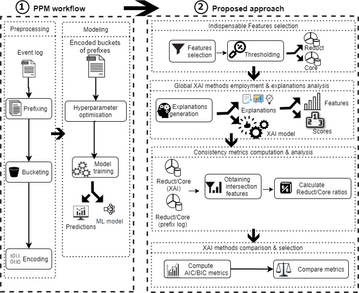

# XAI_predictivemonitoring_Consistency
This repo contains experiments executed to prove the applicability of a proposed approach to evaluate global XAI methods. The evaluation approach examins how explanations agree with ground truth extracted from underlying data. The full illustration of the new approach is available in the paper with the title: __"Why Should I Trust Your Explanation?: An Evaluation Approach of XAI Methods Applied to Predictive Process Monitoring Results"__. Our experiments and illustrations are with respect to Predictive Process Monitoring (PPM) event logs and in the context of a PPM pipeline. Figure 1 provides an overall view of the approach workflow. 

To use this repo:

Run "Main.py". This module calls others to train a model for each preprocessed event log, then calls explanation module to explain predictions. It also calls necessary functions to compute the different metrics needed to evaluate and compare different XAI methods.

"experiments.py" contains some experiments executed to validate our ratios computation based on scores rather than the raw number of features at the intersection.
